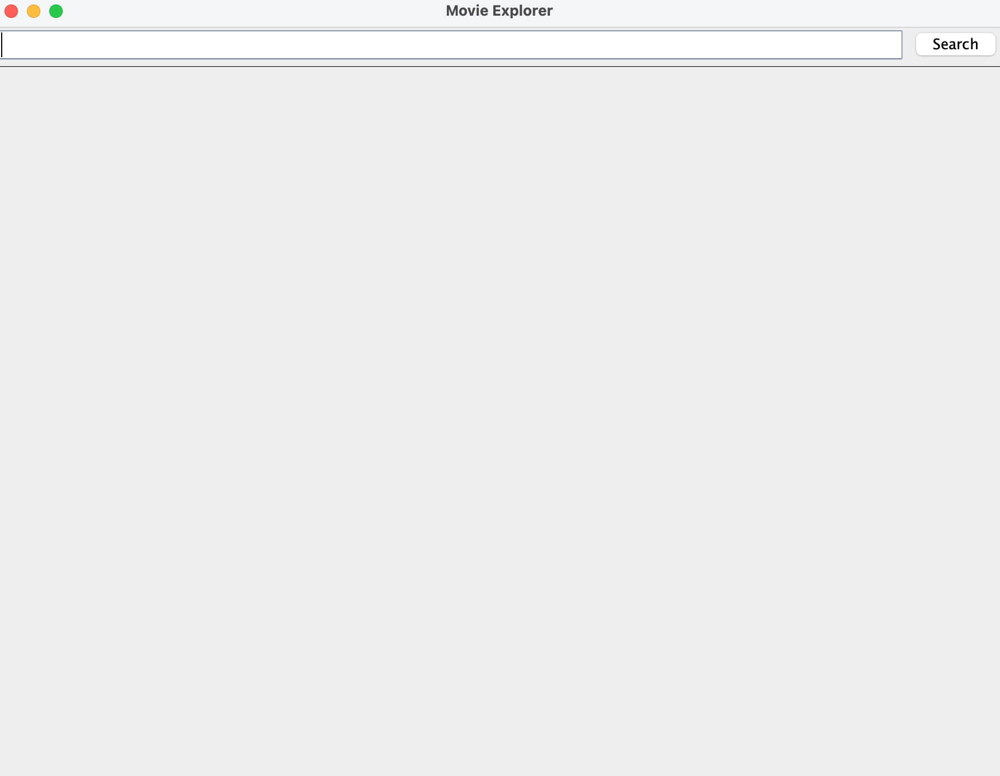
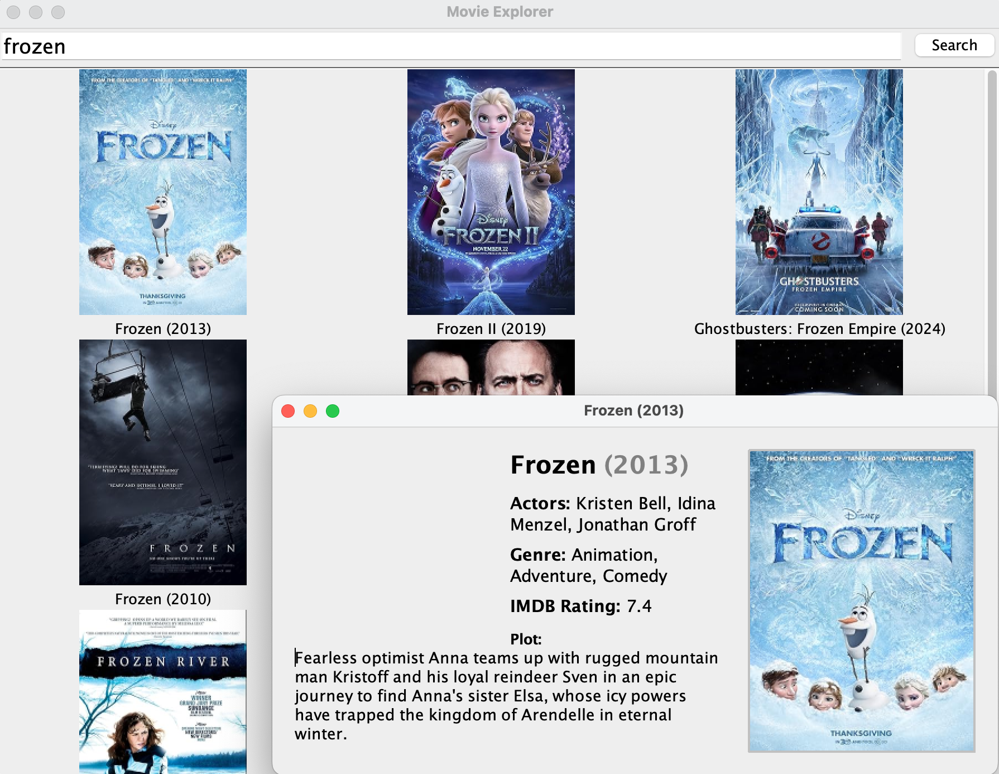

# Movie Explorer
A simple Java application for searching movies and viewing details using the OMDb API.

## Description
Movie Explorer allows users to search for movies by title, view a grid of movie posters, and click on any movie to see detailed information including plot, actors, genre, and IMDb rating. The app uses RxJava and Retrofit for asynchronous API calls and displays results in a modern Swing GUI.

## Screenshots
### Main Search Screen

### Movie Details Popup

## Authors
**Bella Remer**
([@bellaremer](https://github.com/bellaremer))

## Acknowledgments
- [OMDb API](https://www.omdbapi.com/)
- [awesome-readme][1](https://gist.github.com/DomPizzie/7a5ff55ffa9081f2de27c315f5018afc)
- Java Swing community

