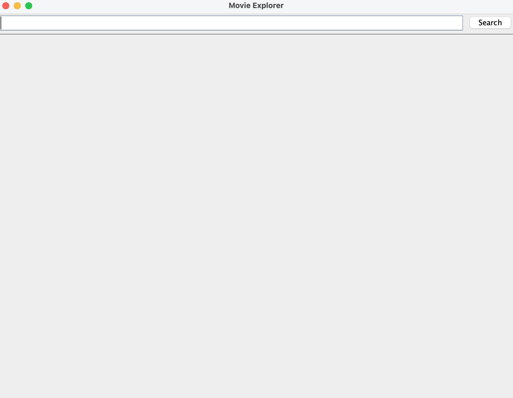
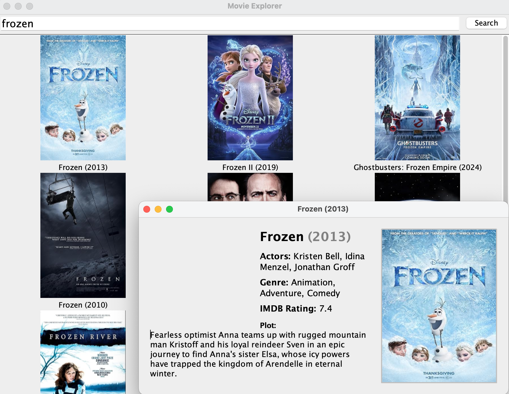

# Movie Explorer

A simple Java application for searching movies and viewing details using the OMDb API.

## Description

Movie Explorer allows users to search for movies by title, view a grid of movie posters, and click on any movie to see detailed information including plot, actors, genre, and IMDb rating. The app uses RxJava and Retrofit for asynchronous API calls and displays results in a modern Swing GUI.

## Getting Started

### Dependencies

- Java 11 or higher
- Gradle (for dependency management)
- Internet connection (to access OMDb API)
- OMDb API key

### Installing

1. **Clone the repository:**
    ```
    git clone https://github.com/yourusername/movie-explorer.git
    cd movie-explorer
    ```
2. **Set up your OMDb API key:**
    - Place your API key in the appropriate location (e.g., `apikeys.properties` or as required by your `ApiKey` class).

3. **Build the project:**
    ```
    mvn clean install
    ```
   or
    ```
    gradle build
    ```

### Executing Program

1. **Run the application:**
    ```
    mvn exec:java -Dexec.mainClass="remer.movieexplorer.MovieExplorerFrame"
    ```
   or run the `main` method in `MovieExplorerFrame.java` from your IDE.

2. **Usage:**
    - Enter a movie title in the search box and press Enter or click "Search".
    - Click on any movie poster to view detailed information in a popup.

## Screenshots

### Main Search Screen



### Movie Details Popup




## Help

- If you have issues with API requests, ensure your API key is valid and you have internet access.
- For Java exceptions, check the stack trace in your console.

## Authors

- Bella Remer ([@bellaremer](https://github.com/bellaremer))

## Version History

- 0.2
    - Various bug fixes and optimizations
- 0.1
    - Initial Release

## License

This project is licensed under the MIT License. 

## Acknowledgments

- [OMDb API](https://www.omdbapi.com/)
- [awesome-readme][1]
- Java Swing community

[1]: https://gist.github.com/DomPizzie/7a5ff55ffa9081f2de27c315f5018afc
